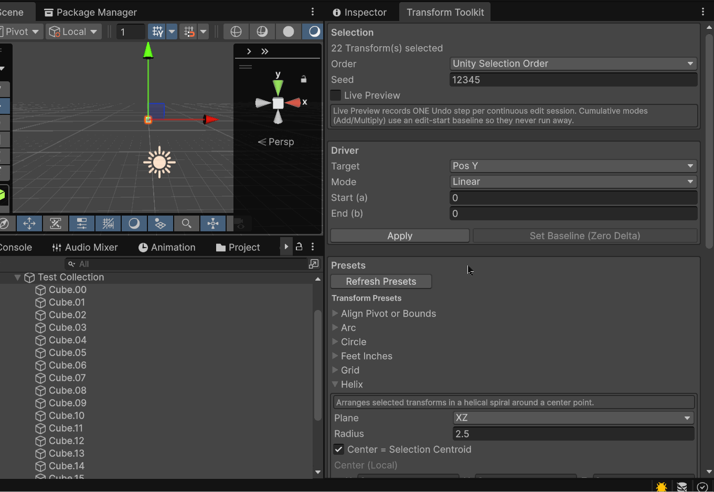

# Transform Toolkit

Transform Toolkit is a Unity Editor package for arranging and modifying groups of GameObjects. It combines an indexed transform driver with reusable presets for layouts, alignment, scattering, scaling, naming, and hierarchy operations.

All operations work on the current Unity selection and support Undo.

## Installation

### Via Unity Package Manager (Git URL)

In Unity: `Window → Package Manager → + → Add package from Git URL`

Use:

    https://github.com/williamrjackson/UnityTransformToolkit.git

Optionally lock to a specific version:

    https://github.com/williamrjackson/UnityTransformToolkit.git#v1.0.1

## Quick start

1. Select two or more GameObjects in the Hierarchy.
2. Open **Tools > Transform Toolkit**.
3. Choose an **Order** for index-based operations.
4. Either configure the transform driver or expand a preset.
5. Enable **Live Preview** when you want to see driver changes immediately, or select **Apply** to perform the operation once.
6. Use **Edit > Undo** to revert an operation.

## Requirements

- Unity 6.0 or later
- Editor use only

## Open the toolkit

In the Unity Editor, select **Tools > Transform Toolkit**.

Select one or more GameObjects in the Hierarchy before applying a driver or preset. The **Selection** section reports the number of selected transforms.

## Selection settings

The settings at the top of the window affect the transform driver and transform presets:

| Setting | Description |
|---|---|
| **Order** | Determines how selected objects are indexed: Unity selection order, hierarchy order, or name order. Index order affects gradients, curves, paths, grids, numbering, and other progressive operations. |
| **Seed** | Controls deterministic random values generated by the driver. Reusing the same seed and selection order reproduces the same result. |
| **Live Preview** | Applies driver changes while values are edited. A continuous editing gesture is recorded as one Undo step. |

Changing the driver target or mode turns off Live Preview to prevent a previous baseline from being applied with new semantics.

## Transform driver

The driver applies one numeric operation to a local transform channel across the ordered selection.

### Targets

- Local position: X, Y, or Z
- Local Euler rotation: X, Y, or Z
- Local scale: X, Y, Z, or uniform XYZ

### Modes

| Mode | Behavior |
|---|---|
| **Set Constant** | Sets the selected channel to one value on every object. |
| **Add** | Adds a delta to the current value. |
| **Multiply** | Multiplies the current value by a factor. |
| **Linear** | Distributes values from **Start** to **End** across the ordered selection. |
| **Random** | Generates a deterministic value between **Min** and **Max** for each object. |
| **Curve** | Evaluates an animation curve across the ordered selection, then maps the result between **Start** and **End**. |

Choose a target and mode, enter the required values, and select **Apply**. When Live Preview is active, **Set Baseline (Zero Delta)** commits the current scene state as the baseline and resets Add or Multiply to its neutral value.

## Presets

Preset settings are stored in ScriptableObject assets. Expand a preset in the window, configure it, and select **Apply**. Select **Refresh Presets** after adding a new preset asset.

### Transform presets

| Preset | Purpose |
|---|---|
| **Align Pivot or Bounds** | Aligns object pivots or renderer/collider bounds to the first- or last-selected anchor, with per-axis min, center, and max rules. |
| **Align to Surface** | Raycasts selected objects toward a surface, optionally positions their bounds against the hit and aligns rotation to the surface normal. |
| **Arc** | Distributes objects between start and end angles on an XY, XZ, or YZ arc. |
| **Catmull-Rom Path Spawner** | Places or spawns objects along a Catmull-Rom spline and can orient them to the path. |
| **Circle** | Distributes objects around a circle. |
| **Feet & Inches** | Converts architectural feet-and-inches input into transform values. |
| **Grid** | Arranges objects in a regular grid. |
| **Helix** | Distributes objects around a helix with configurable radius, turns, height, plane, and origin. |
| **HUD Frame Anchor** | Maps a point on a UI RectTransform to a 3D position relative to a camera. |
| **Jitter** | Adds deterministic random position, rotation, and uniform-scale variation. |
| **Line** | Distributes objects from a start point to an end point. |
| **Look At Point** | Rotates objects toward a target or the selection centroid with per-axis rotation constraints. |
| **Match Transform** | Copies selected position, rotation, or scale axes from a source transform in local or world space. |
| **Mirror** | Mirrors positions across an X, Y, or Z plane. |
| **Noise Scatter** | Offsets or positions objects using coherent noise with configurable frequency, strength, origin, and axes. |
| **Progressive Scale** | Interpolates between two scale values across the selection using an animation curve. |
| **Proximity Scale** | Scales objects according to their distance from a target. |
| **Staggered Rows** | Creates staggered, alternating, or checkerboard layouts in the XY, XZ, or YZ plane. |
| **Wave** | Arranges objects along one axis while applying a sinusoidal offset on another. |

### Selection presets

| Preset | Purpose |
|---|---|
| **Multi-Rename** | Replaces text in selected names and supports optional context tokens such as `{parent}`, `{scene}`, `{project}`, `{tag}`, and `{layer}`. A preview shows proposed names before applying. |
| **Renumber** | Renames selected objects using Unity's naming scheme or an override scheme, digit count, and selection order. |
| **Reorder Hierarchy to Selection** | Changes sibling order to match the configured selection order, optionally requiring a common parent. |

Selection operations are also available from the **Edit** and **GameObject** menus:

- **Multi-Rename**
- **Renumber**
- **Reorder Hierarchy To Selection**

## Creating preset assets

Create additional preset assets from **Assets > Create > Transform Toolkit**. Transform presets appear under **Presets**, and naming or hierarchy operations appear under **Selection Presets**.

The toolkit discovers all enabled `TransformPreset` and `SelectionPreset` assets in the project. A preset asset controls its display name, whether it appears in the window, and whether its settings are initially expanded.

## Extending Transform Toolkit

To add a transform operation:

1. Derive a ScriptableObject from `Wrj.TransformToolkit.TransformPreset`.
2. Add a `CreateAssetMenu` attribute.
3. Implement `DrawGUI(PresetContext context)`.
4. Implement `Apply(PresetContext context, Transform[] targets)`.
5. Create the preset asset and refresh the toolkit window.

To add an operation that changes selection metadata or hierarchy rather than transform values, derive from `Wrj.TransformToolkit.SelectionPreset` and implement `DrawGUI()` and `Apply(GameObject[] targets)`.

The window records Undo before calling transform presets. Selection presets that modify objects should use Unity's Undo API for every affected object or hierarchy operation.

## Coordinate and ordering notes

- Driver position, rotation, and scale values use local transform space.
- Presets label local-space inputs where relevant; some presets offer explicit world-space behavior.
- A single selected object receives the start of a linear or curve range.
- Results that depend on index are only stable while the selection and its ordering mode remain unchanged.
- Random driver values and jitter-style presets are deterministic when their seed and input order are unchanged.

## Package contents

| Location | Description |
|---|---|
| `Editor/TransformToolkit` | Editor window, preset framework, and menu integrations. |
| `Editor/TransformToolkit/Presets` | Built-in preset implementations and configured preset assets. |
| `README.md` | Canonical package documentation. |
| `Documentation/Transform Toolkit.md` | Redirect to the canonical README for Unity documentation navigation. |
| `Runtime` | Runtime assembly placeholder; current toolkit features are Editor-facing. |

## Troubleshooting

**No presets appear**

Select **Refresh Presets**. Confirm the preset asset exists in the project and that **Enabled In Window** is enabled on the asset.

**A progressive layout uses an unexpected order**

Change **Order** at the top of the window. Hierarchy order and name order are generally more predictable than Unity selection order.

**Add or Multiply appears to compound during preview**

Live Preview uses an edit-session baseline to prevent runaway accumulation. End the gesture or select **Set Baseline (Zero Delta)** before beginning the next adjustment.

**A surface alignment does nothing**

Confirm the ray direction and maximum distance reach a collider, and review the trigger interaction setting.

## Version

This documentation applies to Transform Toolkit 0.0.2.
